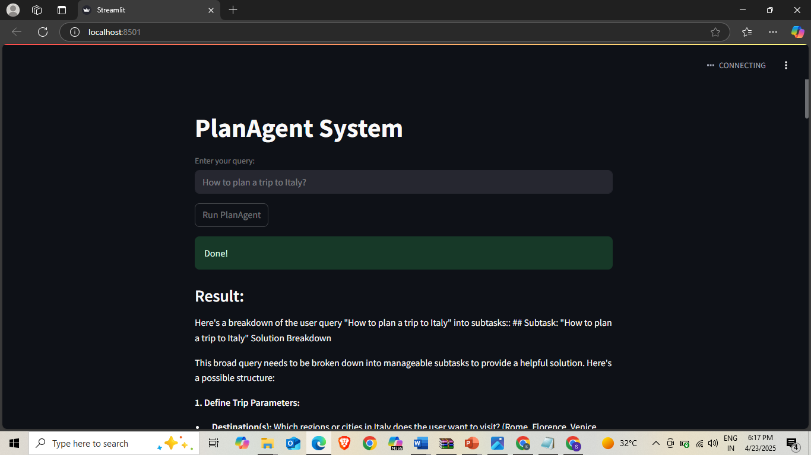
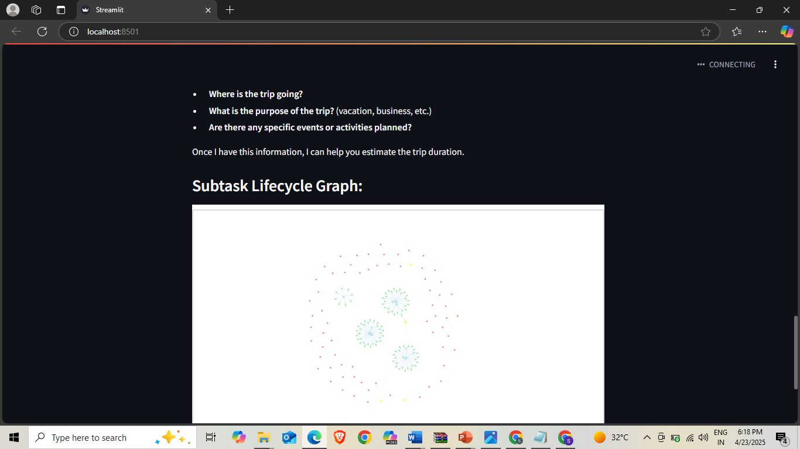

# 🧠 PlanAgent System

**PlanAgent** is an AI-powered task planning and execution system that breaks down complex queries into subtasks, solves them iteratively, and refines the plan as needed. It leverages **LangGraph** for workflow orchestration and **Groq's LLM API (Mixtral-8x7b-32768)** for advanced natural language processing.

## 🚀 Features
* 🧩 **Task Decomposition** – Automatically breaks user queries into manageable subtasks
* 🔁 **Iterative Refinement** – Improves the plan based on intermediate results
* 🌐 **Interactive Visualization** – View the subtask lifecycle through a flowchart
* 🎛 **Streamlit Web Interface** – Easy-to-use interface for end users

## 🏗 Architecture
PlanAgent follows a multi-stage workflow:
1. 📋 **Planning** – Breaks down the user query into subtasks
2. 🛠 **Solving** – Tackles each subtask one by one
3. 🧪 **Refinement** – Evaluates results and suggests modifications to the plan
4. 📦 **Finalization** – Compiles all subtask results into a comprehensive answer

## 🖼️ Results
The application provides users with:





## ⚙️ Installation
1. **Clone the repository**

```bash
git clone https://github.com/yourusername/planagent.git
cd planagent
```

2. **Install dependencies** Ensure you have Python 3.9+ installed, then run:

```bash
pip install -r requirements.txt
```

3. **Install Graphviz** (for visualization)
   * On Ubuntu: `sudo apt install graphviz`
   * On macOS: `brew install graphviz`
   * On Windows: Download and install from Graphviz website
4. **Set up environment variables** Create a `.env` file in the project root:

```
GROQ_API_KEY=your_groq_api_key_here
```

## 🖥 Usage
1. **Launch the Streamlit app**

```bash
streamlit run app.py
```

2. **Open your browser** at http://localhost:8501
3. **Enter your query** in the text field Example: *"How to plan a trip to Japan?"*
4. **Click "Run PlanAgent"** – Watch it process and solve in real-time 🔍
5. **View the output** and explore the **subtask lifecycle flowchart** 🧠📊

## 📁 Project Structure

```
planagent/
├── app.py                # Streamlit UI for user interaction
├── implementation.py     # Core logic using LangGraph and Groq LLM
├── requirements.txt      # Python dependencies
├── .env                  # Environment variables (API keys)
└── README.md             # Project documentation
```

## 🧬 Technical Details

### 🗂 State Management
The system uses a `TypedDict` to manage its state:

```python
class AgentState(TypedDict):
    user_query: str
    subtasks: List[str]
    current_subtask: Optional[str]
    subtask_results: Dict[str, str]
    final_result: Optional[str]
    iteration_count: int
    max_iterations: int
    history: List[Dict[str, List[str]]]
```

### 🤖 LLM Integration
Integrates with Groq's LLM using LangChain:

```python
from langchain_groq import ChatGroq
llm = ChatGroq(groq_api_key=GROQ_API_KEY, model_name="mixtral-8x7b-32768")
```

### 📈 Visualization
Visualized using **Graphviz** as a flowchart:
* 🟩 **Generated subtasks** – Light green
* 🟨 **Solved subtasks** – Yellow
* 🟥 **Refined subtasks** – Light coral
* 🔷 **Iteration phases** – Light blue

## 🔧 Customization
You can tweak the behavior by:
* Adjusting `max_iterations` in `AgentState` (default is 3)
* Updating prompt templates in `implementation.py`
* Changing `model_name` in the LLM initialization (e.g., try other Groq models)

## 🌱 Future Improvements
* 🧵 Support for parallel subtask execution
* 🧠 Long-term memory support
* 💬 Feedback loop for user-influenced generation
* 🎨 More visualization styles and themes
